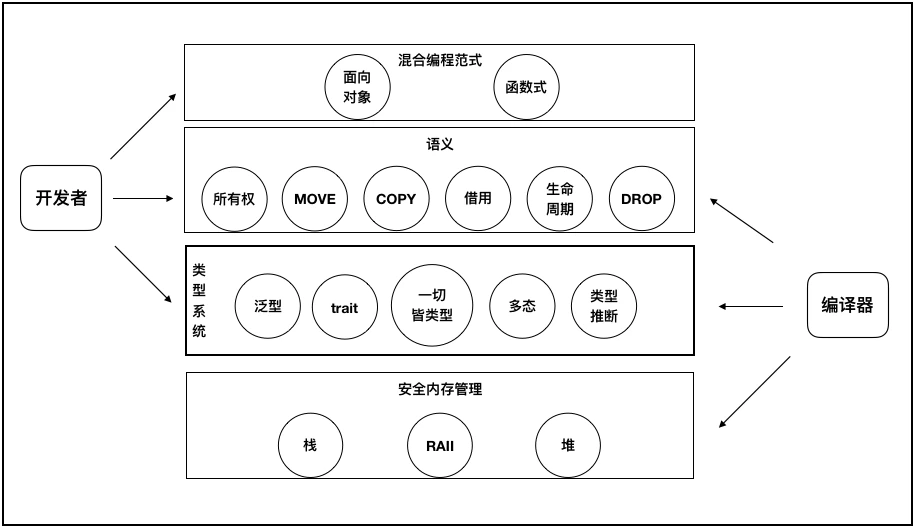

- [《想要改变世界的 Rust 语言》](https://www.infoq.cn/article/Uugi_eIJusEka1aSPmQM) #read
	- > 有人把 Rust 称为”The New C“，我十分认同，Rust 是开启新时代的语言。但 Rust 可能不像其他语言那样，突然冒出一个杀手级应用来引领某个领域的一段潮流。Rust 改变世界的方式，正好可以用古人的诗词来形容，”好雨知时节，当春乃发生。随风潜入夜，润物细无声“。
	  >
	  > Rust 语言不是银弹，它也不追求完美，它只是在由 C 和 C++构建的旧世界之上，寻求更好的问题解决之道。
	- Rust 中概念层次结构梳理
		- 