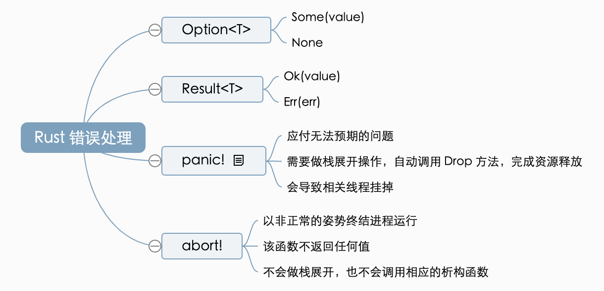
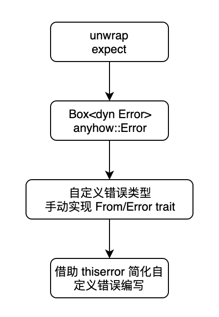

- [Bitcask: A Log-Structured Hash Table for Fast Key/Value Data](https://github.com/basho/bitcask/blob/develop/doc/bitcask-intro.pdf) #read
	- [Bitcask](https://github.com/basho/bitcask/blob/develop/doc/bitcask-intro.pdf) 是一款高性能、基于日志结构的 Key/Value 存储
		- 读写低延迟
		- 高吞吐
		- 可以处理超出 RAM 容量的数据集
		- 只需要单次磁盘 Seek 即可定位数据
		- 查找和写入性能可预测
		- 快速、有界的崩溃恢复能力
		- 备份简单
	- 缺点是所有的键必须能够放入到内存
- [Error Handling in Rust](https://blog.burntsushi.net/rust-error-handling/) #read
	- [中文翻译](https://ifaceless.github.io/2020/06/02/rust-error-handling/)
	- 
	- {:height 652, :width 446}