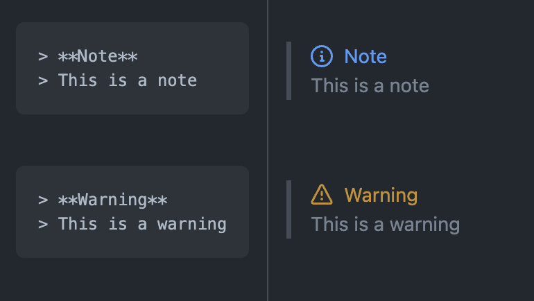

- [GitHub 正在为 Markdown 预览添加一些花哨的区块引用](https://github.com/github/feedback/discussions/16925)
	- {:height 196, :width 419}
- [Migrating millions of lines of code to TypeScript](https://stripe.com/blog/migrating-to-typescript) #read