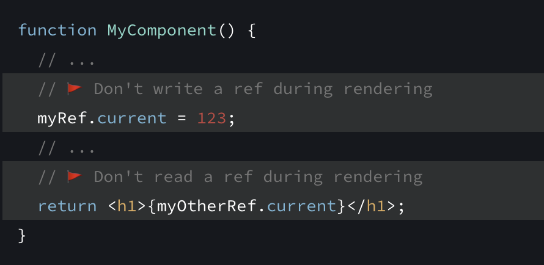

- 在使用 eslint-plugin-jsx-a11y 时，如果自定义组件遇到了 [label-has-associated-control](https://github.com/jsx-eslint/eslint-plugin-jsx-a11y/blob/main/docs/rules/label-has-associated-control.md) 报错，记得在 ESLint 配置文件内添加如下配置：
	- ```
	  {
	    "rules": {
	      "jsx-a11y/label-has-associated-control": [ 2, {
	        "controlComponents": ["CustomInput"],
	        "assert": "both",
	      }],
	    }
	  }
	  ```
- [Do not write or read ref.current during rendering.](https://beta.reactjs.org/apis/useref#referencing-a-value-with-a-ref:~:text=Do%20not%20write%20or%20read%20ref.current%20during%20rendering.)
	- 
- 学到了 Chrome 上的一个使用技巧：[Scroll to Text Fragment](https://chromestatus.com/feature/4733392803332096)
	- 例如，这个链接：[https://en.wikipedia.org/wiki/Cat#:~:text=On%20islands,%20birds%20can%20contribute%20as%20much%20as%2060%%20of%20a%20cat%27s%20diet]，点击它将加载 Cat 的 wiki 页面，突出显示指定的文本，并直接滚动到该文本
-