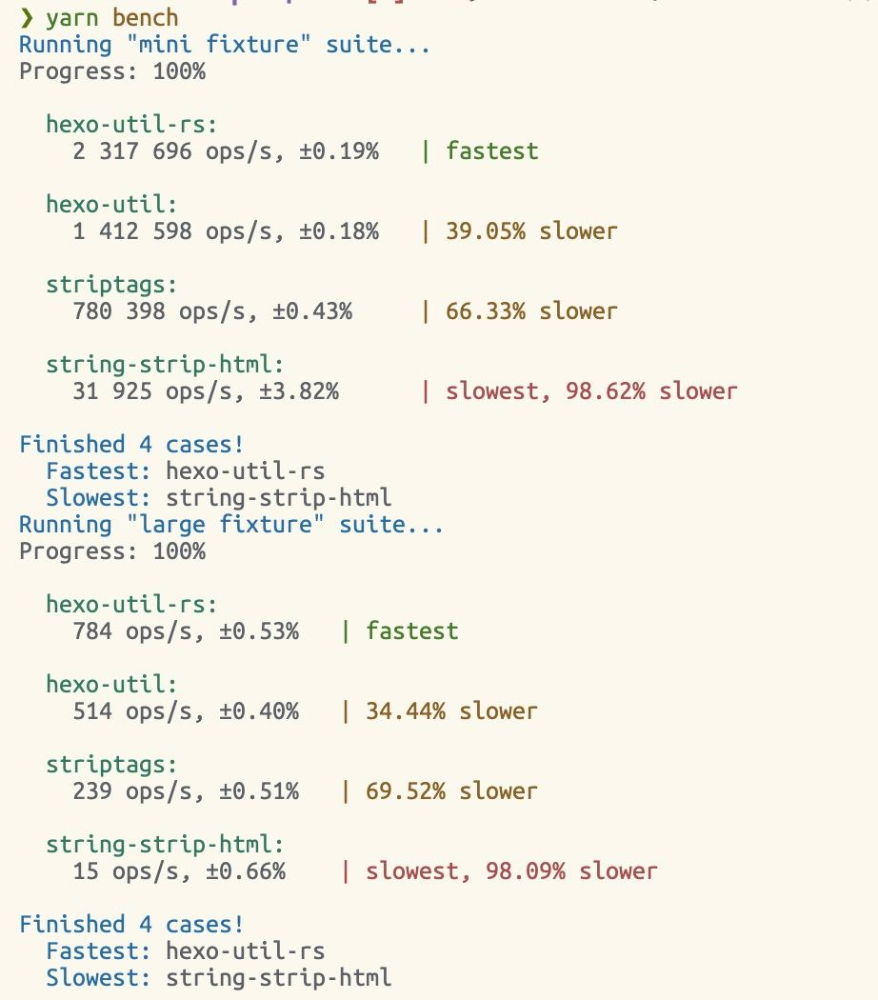

- 用 [[Rust]] 重写了 Hexo util 的 [strip_html](https://github.com/hexojs/hexo-util/blob/master/lib/strip_html.js)，使用 NAPI 的 benchmark 的结果要比 WASM 好，Sukka 这样说：
	- > 稍微大一点的 fixture 上挼斯特才有优势啊
	  应该是字符串体积小的时候，Node API 的 overhead 比较大
	  但是字符串体积大的时候，Node.js 就有些力不从心了、然后 Native 的优势就出来了
	- 经过太狼的一番优化后，就全面超越了
		- 
	- 采用的主要优化手段是使用 `String::with_capacity()` 替换 `String::new()` 以及使用 `foreach` 替换 `for` 循环，PR [链接](https://github.com/liby/hexo-util-rs/pull/2/files)