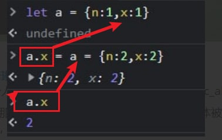

- [[Rust]] [的 let-else 语句稳定了，它是 if-let 表达式的对应物](https://github.com/rust-lang/rfcs/blob/master/text/3137-let-else.md)
- [手写 JS 引擎来解释一道赋值面试题](https://zhuanlan.zhihu.com/p/464994209) 中的解释是错的，`a.x = a = { ... }` 的运算顺序是先留下 `a.x` 的引用，然后计算 `a = ...` ，然后再把结果送到原先那个 `a.x` 上
	- 