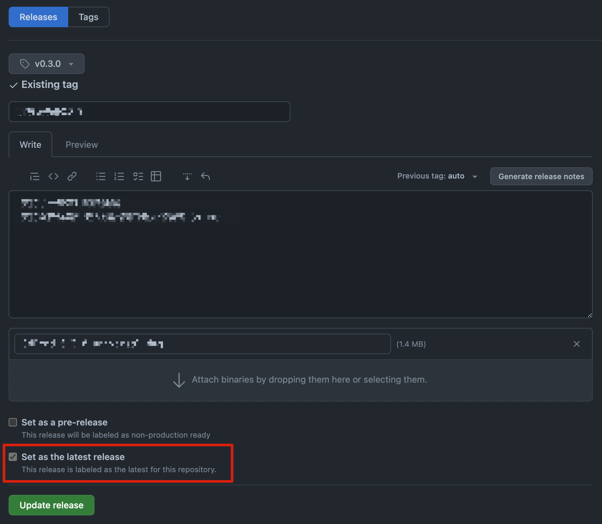

- [用 YubiKey 存 TOTP secret 的 2FA App](https://www.yubico.com/products/yubico-authenticator/)
- `pnpm update` 只会根据指定的版本范围进行升级，如果你写死了版本号，没有加 `^` 或者 `~` 之类的标识符，是不会对包进行升级操作的
- 在使用 GitHub 手动发布 release 的时候，发现最新版本显示的不对，一番研究后，才发现在发布新版本时，要记得勾选 **Set as the latest release** 选项才行
  - 
