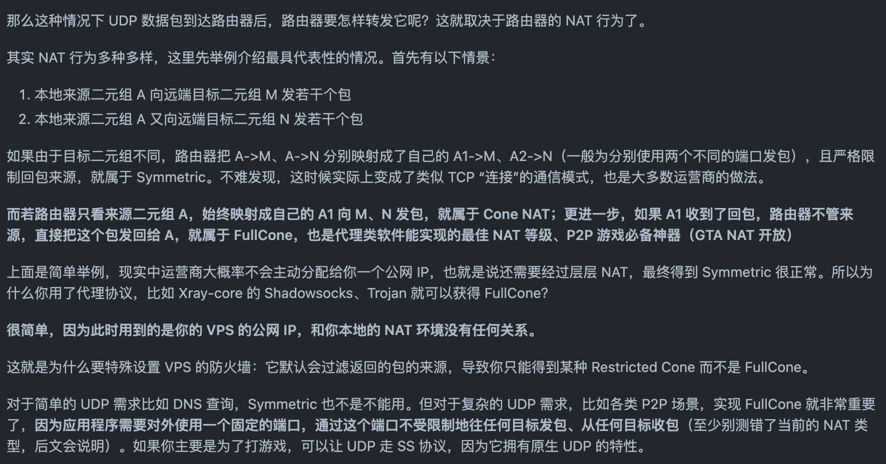

- [进阶必读：代理协议 UDP 全方位透彻解析](https://github.com/XTLS/Xray-core/discussions/237)
	- 确定一个 TCP 连接的是「五元组」：
		- 1. TCP 协议本身的标识
		  2. 自己的 IP 地址
		  3. 自己使用的一个端口（Port）
		  4. 对方的 IP 地址
		  5. 对方使用的一个端口
	- TCP 连接建立后，双方都可以一边发送数据、一边接收数据，这就是全双工的
	- 「端口」常和 IP 一起出现，但它不属于 IP 协议，它属于更上层的 TCP、UDP 协议。TCP、UDP 是分别实现了「端口」这一标识方式，所以这两个协议的「端口」不会互相影响。 `ping` 用到的协议是 ICMP，它也是基于 IP 数据包，与 TCP、UDP 是类似的，但 ICMP 就没有「端口」这个概念
		- 常见的代理协议只能代理 TCP 或再加个 UDP，不能代理 ICMP，所以就无法 `ping`
	- 简单理解 UDP 协议：只是在 IP 协议的基础上加了一个端口机制和校验
		- 即申请到一个本地 UDP 端口后，不需要握手/建立连接即可直接向任意 IP 的任意 UDP 端口发送应用数据。 不需要关心对方有没有收到数据，对方也不会告诉你有没有收到数据
	- FullCone、Symmetric 指的都是 NAT 行为，NAT 的全称为 Network Address Translation
		- 就是路由器、各级运营商做的事情：地址转换。NAT 的广泛存在是因为 IPv4 地址不足，另一方面它还可以保护局域网中的设备
		- 对于 TCP 而言，NAT 行为是什么并不重要，因为 TCP 是双向的流，本机每发起一个 TCP 连接往往会使用一个新的临时端口，从而对应一个新的五元组
		- 但对于 UDP，NAT 行为非常重要，因为 UDP 是方向不定的包，使用同一个本地 UDP 端口向不同的目标二元组发包十分常见
			- 二元组：IP 和 Port，任一不同即视为不同的二元组
		- 