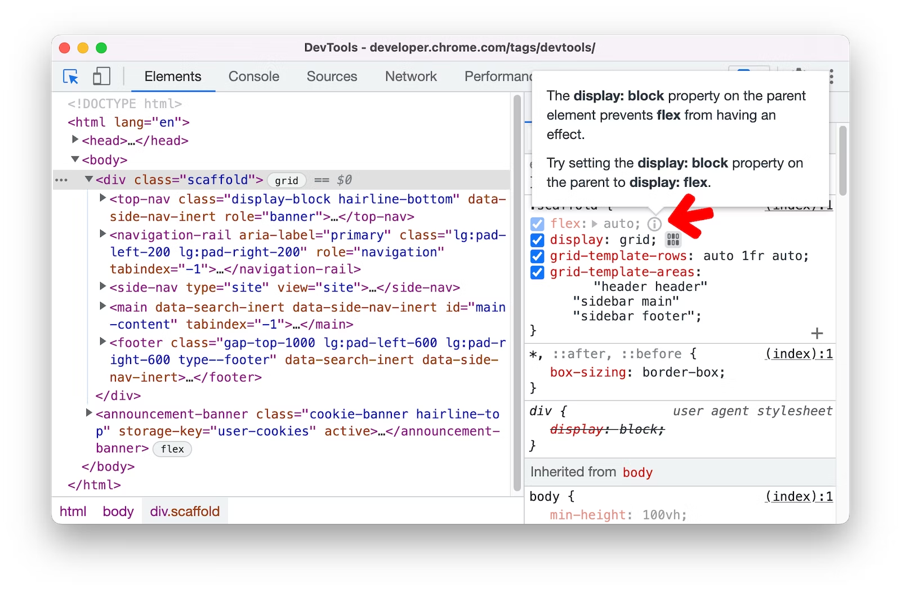

- [DevTools 现在可以识别那些语法有效但在页面上没有效果的 CSS 样式](https://developer.chrome.com/zh/blog/new-in-devtools-108/#css-hint)
	- 许多 CSS 属性只能在特定的上下文/使用特定的布局模式下工作。此更新让我们知道何时缺少隐式依赖项
	- 
	- [Related tweets](https://twitter.com/JoshWComeau/status/1598004998666743808)