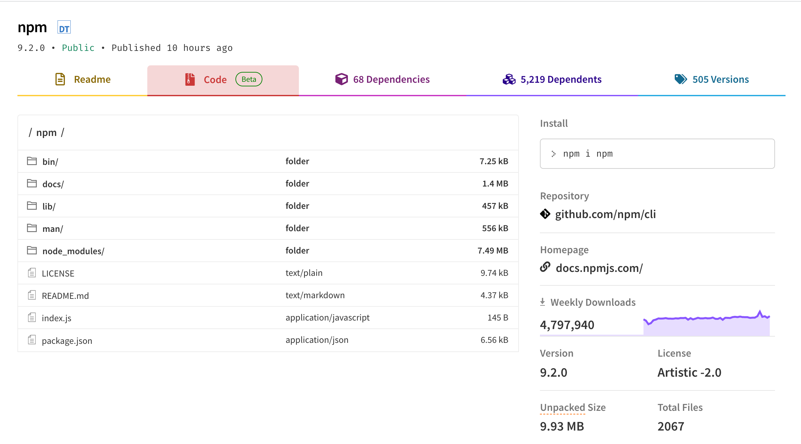

- [`useSyncExternalStore` 是一个允许订阅外部 store 的 React Hook](https://beta.reactjs.org/apis/react/useSyncExternalStore#usage)
	- `useSyncExternalStore(subscribe, getSnapshot, getServerSnapshot?)`
		- `subscribe` 函数接受一个回调函数作为参数，并将其订阅到 store 上。当 store 更改时，它会调用提供的回调函数，从而使组件重新渲染。
			- `subscribe` 函数应该返回一个清除订阅的函。
		- `getSnapshot` 函数返回 store 中组件所需的快照数据。在 store 未更改的情况下，对 `getSnapshot` 的重复调用必须返回相同的值。如果 store 更改且返回的值不同（按 `Object.is` 比较），React 就会重新渲染组件
		- `getServerSnapshot` 是可选的，它返回 store 中的初始快照数据。仅会在服务器端渲染和服务器端渲染内容在客户端上的水合期间使用。
			- 服务器快照在客户端和服务器端之间必须相同，通常会序列化并从服务器端传递到客户端。如果未提供此函数，在服务器端渲染组件将抛出错误
- NPM 提供了 [Code explorer](https://github.blog/2022-12-06-new-npm-features-for-secure-publishing-and-safe-consumption/#code-explorer-gives-visibility-into-the-contents-of-a-package-directly-from-the-npm-portal) 的支持
	- 