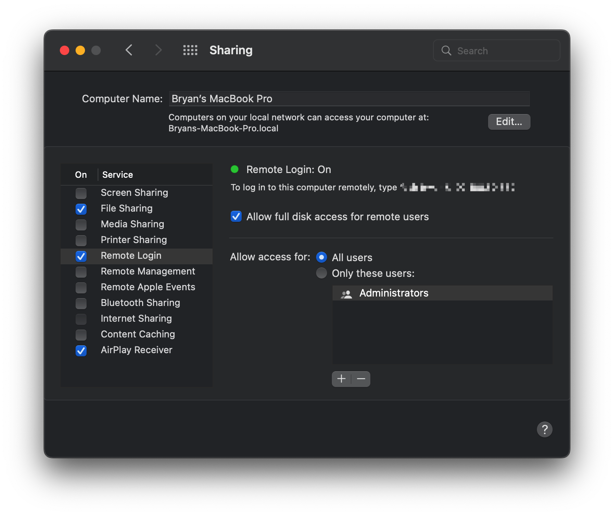

- [在 Mac 上 使用 Surge 做旁路由的周边搭配](https://jiapan.me/2022/surge-soft-router-perimeter/)
	- 使用 [Amphetamine](https://apps.apple.com/cn/app/amphetamine/id937984704) 来让电脑保持不休眠的状态
- Surge 内置了多个不同的 REJECT 策略
	- REJECT：拒绝该请求，当连接类型为 HTTP 时，会返回一个错误页面。（该行为可被 show-error-page-for-reject 参数控制）
	- REJECT-TINYGIF：拒绝该请求，当连接类型为 HTTP 时，返回一个 1px 的 GIF 图片响应。若为其他类型连接则直接断开。该策略主要用于 Web 广告屏蔽
	- REJECT-DROP：拒绝该请求，与 REJECT 不同的是，该策略将静默抛弃请求。因为部分程序有着十分暴力的重试逻辑，连接失败后会立刻进行重试，导致请求风暴
		- 如果发往某主机名的请求短时间内大量触发 REJECT/REJECT-TINYGIF 策略（当前版本的阈值为 30 秒内 10 次），为了避免产生大量资源浪费，Surge 将自动升级 REJECT 策略为 REJECT-DROP 策略
- [拓扑图绘制工具](https://whimsical.com/)
- [使用 Surge 轻松访问家中的网络服务](https://community.nssurge.com/d/5)
	- 1.  将内网的网段修改为一个不常见的网段，以避免与在外面使用的 WiFi 网络的内网 IP 冲突导致问题
	- 2.  在内网建立一个代理服务器，如果在家中有一个长期开启的 macOS 设备，推荐直接使用 Surge for Mac [运行 Snell 代理服务](https://manual.nssurge.com/others/snell-server.html)
	- 3.  配置路由器，将 6160 端口的 TCP 访问转发至你运行代理服务机器的 `局域网 IP:6160`
	- 4.  配置 DNS 解析指向家中公网 IP 的域名，如：home.liby.me；
		- 4.1 可以配置 DDNS 解决公网 IP 变动的问题
		- [4.2 或者通过使用 Surge for Mac 里的 sgddns 功能来代替 DDNS/DNS 解析](https://twitter.com/taresky/status/1447012685648838662)
			- [如果你用 Surge，连 DDNS 都不需要，基于 iCloud 用 sgddns，降低泄漏 DDNS 域名的风险](https://twitter.com/taresky/status/1557578761067184128)
	- 5.  在需要远程访问内网的设备上配置如下规则
		- ```
		  [Proxy]
		  HomeProxy = snell, home.yach.me, 6160, psk=password
		  
		  # 为了在内网中使用时，不再通过代理进行转发，可以使用 SSID Group
		  [Proxy Group]
		  Home=ssid, default=HomeProxy, HomeSSID=DIRECT, HomeSSID2=DIRECT
		  
		  # 最后加入相应的规则
		  [Rule]
		  IP-CIDR,192.168.150.0/24,Home,no-resolve
		  ```
	- 6.  启动 [[Surge]]，在外面任何地方都可以通过访问家中对应服务的局域网 IP 来访问它
	- [x86 软路由&群晖使用指南 - Surge 配置](https://taresky.com/x86-guide#:~:text=%E5%9F%9F%E5%90%8D%E3%80%82-,Surge%20%E9%85%8D%E7%BD%AE,-%E6%8C%89%E7%85%A7%20Surge%20Guide)
		- > 按照 Surge Guide 教程的域名配置，我自己实验失败了，配置域名跳转到内网 IP 后解析成功，但始终无法访问。最后我使用了更简单粗暴，而且不需要可配置域名的办法
	- [[Surge]] 教程：[通过 Snell 服务器访问内部局域网设备](https://www.youtube.com/watch?v=hy9MO4wwfwE)
		- 需要先在 System Preferences > Sharing 中打开对应的访问权限
			- 