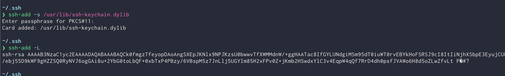

- [YubiKey 配置 SSH 证书认证](https://wangye.org/posts/2021/04/configure-yubikey-for-ssh-authentication.html)
	- [YubiKey 配置 SSH 证书认证]( https://wangye.org/posts/2021/04/configure-yubikey-for-ssh-authentication.html)
	- [PIV  通过 PKCS#11 和 SSH 进行沟通](https://developers.yubico.com/PIV/Guides/SSH_with_PIV_and_PKCS11.html)
		- macOS 内置的 PKCS#11 程序在 `/usr/lib/ssh-keychain.dylib`
			- [曾经出现过找不到文件的情况，不保证一定存在](https://developer.apple.com/forums/thread/670307)
			- 将其设置为与与 ssh-agent 一起使用时，使用 `ssh-add -L` 输出，会看到乱码，结合上面的问题，不推荐使用
				- 
		- 通过 Homebrew 安装的 libykcs11 在 `/opt/homebrew/Cellar/yubico-piv-tool/x.y.z/lib/libykcs11.x.y.z.dylib`
		- ```
		  $ ssh-add -s /opt/homebrew/Cellar/yubico-piv-tool/2.3.0/lib/libykcs11.2.3.0.dylib
		  Enter passphrase for PKCS#11:
		  // or
		  $ ssh-add -s /usr/lib/ssh-keychain.dylib
		  Enter passphrase for PKCS#11:
		  ```
		- [macOS 13 - Issue - use of libykcs11.dylib](https://github.com/Yubico/yubico-piv-tool/issues/387)
	- [YubiKey SSH YKCS11 in macOS](https://gist.github.com/marfillaster/22f44d53f4794c78c52ce745ab81ccdb)
		- ```
		  # ~/.ssh/config
		  Host *
		      PKCS11Provider /usr/local/lib/libykcs11.dylib
		  
		  brew install ykman yubico-piv-tool
		  
		  # Generate key
		  ykman piv keys generate -aRSA2048 --pin-policy ONCE --touch-policy NEVER 9a public.pem
		  
		  
		  # Generate self signed key
		  ykman piv certificates generate -s "CN=yubi-1 ssh" -aSHA256  9a public.pem
		  
		  # Generate openssh public key to be added in remote authorized_keys
		  yubico-piv-tool -a status -a verify-pin -a read-certificate -s 9a -KSSH
		  ```