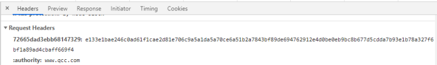

- ### 之前刷推说看到别人在因为帮女朋友/老婆解决个什么问题而开发了一个产品最后大获成功的例子，便问了一下马婷达工作上有没有什么事情感觉特别麻烦，我可以尝试用代码帮她解决，她提到了一个需求：工作中需要到企查查之类的网站查看指定公司的资质证书是否临近到期，如果还有 6 个月左右就要到期，可以给她发个提醒
	- #### 我一开始的想法是用油猴脚本，在企查查的页面上插一个按钮，点击出来一个弹窗，显示部分公司临近到期的证书列表
		- 写着写着就发现不对劲了，首先企查查作为一个靠内容吃饭的公司，反爬上是下了一番功夫的，我注意到每次请求都会带上一个 hmac 算法生成的身份验证
			- 
		- 其次，在调试代码的时候频繁刷新页面，还触发它的风控，风控前可以不登录浏览一些信息，风控后每次访问都会帮我重定向到登录页。尝试清空 Cookie、Storage、开启无痕模式、切换浏览器都没有用，不知道是通过什么方式识别到了设备，同一 IP 下的其他设备访问不受影响
		- 最后，我又仔细想了一下，如果要查询的公司有很多的话，维护这么一份列表，硬编码在代码中也很奇怪，增删改非常麻烦
	- #### 在油猴脚本的尝试失败后，我痛定思痛，开始重新分析需求，并且又跟马婷达聊了聊；最后我认为我这次的代码应该是一次性的，只需要帮她把目前需要梳理的公司（大概几十家）的证书信息拉出来，保存为一个表格（包含公司名称、证书名称、开始日期、结束日期），后续如果她再碰到有新的公司需要跟进，那么编辑这个表格就可以了
		- 并且 Excel 之类的表格足够强大，完全可以做到按照她的要求进行排序：将临近到期的证书显示在上面
	- #### 既然直接运行脚本的方式行不通，我转头就想到了前端测试 E2E 测试常用的 Cypress 以及 Playwright
		- 说来也巧，我在工作中使用 Cypress 比较多，不过最近技术调整，正准备向 Playwright 迁移，借此机会，顺便熟悉一下 Playwright 也不错
		- Playwright 的文档非常完善，通过 `npm init playwright@latest` 在当前文件夹内构建项目，而后就可以直接开始编写测试，无需其他设置
		- 同时，还可以安装 [VS Code extension](https://marketplace.visualstudio.com/items?itemName=ms-playwright.playwright)
			- 可以在侧边栏打开它来运行一个测试或一组测试
			- 我后面是写了一个字符串数组，里面都是公司名称，并且循环这个数组来调用测试，这个插件很贴心的帮我把循环后的测试显示为一组展示了出来，非常方便进行单独调用
		- 由于企查查反爬做的很严格，光登录验证码就有好几种，所以想要模拟账号登录非常困难，好在 Playwright 支持 [Preserve authenticated state](https://playwright.dev/docs/codegen#preserve-authenticated-state)，只需要运行 `playwright codegen --save-storage=auth.json` 登录一下，就很方便的拿到了  cookies 和 localStorage 并保存到本地
			- 后面我们再通过 Playwright 提供的 [Reuse signed in state](https://playwright.dev/docs/test-auth#reuse-signed-in-state) 功能，为 `storageState `指定一下刚刚保存的 cookies 和 localStorage 的文件路径即可
		- 最后，一个小小的缺憾就是由于同时运行一组测试，会直接触发风控，企查查会弹出提示：你的操作过于频繁；所以只能单独运行每个测试，耗费了一些时间
	- #### 剩下的事情就比较简单了，通过运行测试，拿到了每个公司的证书信息存在了 json 文件里，写了个脚本把所有的 json 合并成一个，并转成 xlsx 文件，完活